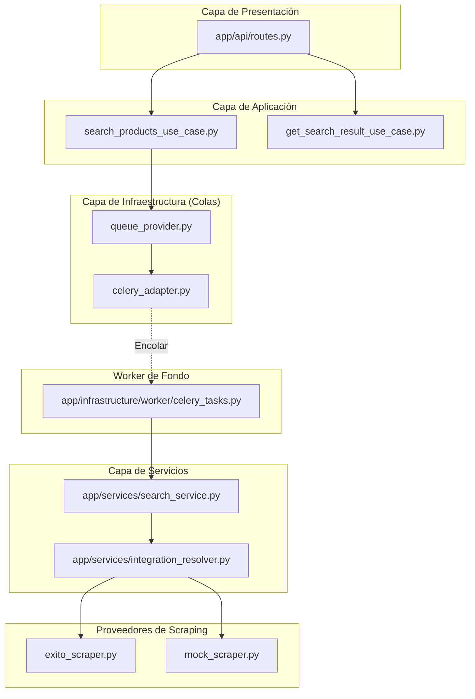

# 🕷️ Web Scraping Éxito -- Demo Backend

Backend demo en **Python** que expone una API REST para buscar productos en un e-commerce (Éxito), utilizando **Playwright** para web scraping y **Celery** para procesamiento asíncrono.

El proyecto está diseñado bajo los principios de **Arquitectura Hexagonal**, permitiendo el desacoplamiento entre la lógica de negocio y las herramientas técnicas (infraestructura).

---

## 🚀 Funcionalidad

- **Búsqueda Asíncrona**: Las peticiones de búsqueda se encolan para no bloquear la API.
- **Seguimiento de Estado**: Permite consultar el estado de una búsqueda (`pending`, `processing`, `completed`, `failed`).
- **Arquitectura de Scrapers**: Soporta múltiples proveedores (Éxito real o Mock para desarrollo).
- **Desacoplamiento de Workers**: Las tareas están desacopladas del motor de colas (Celery/RQ compatible).

---

## 🧠 Arquitectura



---

## 📁 Estructura del Proyecto

```text
app/
├── api/                       # Endpoints y dependencias de FastAPI
├── application/               # Casos de uso (Lógica de orquestación)
├── core/                      # Configuración global, Celery App y Logger
├── infrastructure/            # Implementaciones técnicas
│   ├── queue/                 # Adaptadores para colas de tareas
│   ├── scraping/              # Scrapers específicos (Playwright)
│   └── worker/                # Wrappers para ejecutar tareas en fondo
├── models/                    # Modelos de dominio (Pydantic)
├── services/                  # Servicios de dominio y utilidades
└── main.py                    # Punto de entrada de la aplicación
```

---

## ⚙️ Variables de Entorno

Configurables en el archivo `.env`:

- `EXITO_ENABLED`: (bool) Habilita el scraping real en Éxito. Si es `false`, usa el Mock.
- `REDIS_URL`: URL de conexión para Redis (Broker y Backend de Celery).

---

## 📦 Gestión de Dependencias

Este proyecto utiliza **[uv](https://astral.sh/uv/)** para una gestión de dependencias rápida y determinista.

---

## ▶️ Ejecución con Docker (Recomendado)

La forma más sencilla de levantar todo el stack (API, Worker, Redis):

```bash
docker compose up --build
```

- **API**: http://localhost:8000
- **Swagger Docs**: http://localhost:8000/docs
- **Health Check**: http://localhost:8000/health

---

## ▶️ Ejecución Local

1. Instalar dependencias:
   ```bash
   uv sync
   uv run playwright install --with-deps
   ```

2. Levantar servicios:
   Se requieren tres terminales o procesos:
   - **Redis**: Debe estar corriendo en el puerto 6379.
   - **API**: `uv run python -m uvicorn app.main:app --reload`
   - **Worker**: `uv run celery -A app.core.celery:celery_app worker --loglevel=info`

O utiliza el script automatizado (solo para la API):
```bash
./run.sh
```

---

## 🛠️ Endpoints Principales

1. **POST** `/api/search?product=licuadora`: Encola una búsqueda. Retorna un `job_id`.
2. **GET** `/api/search/{job_id}`: Consulta el estado o el resultado final de la búsqueda.

O manualmente:

    uv run python -m uvicorn app.main:app --reload --host 0.0.0.0 --port 8000

------------------------------------------------------------------------

## 📌 Endpoint

    GET /api/search?product=licuadora

------------------------------------------------------------------------

## 🛠️ Tecnologías

-   Python 3.13
-   FastAPI
-   Playwright
-   Docker & Docker Compose
-   uv (gestor de dependencias)
-   python-dotenv

------------------------------------------------------------------------

## 👤 Autor

José Gomez\
Arquitecto / Backend Developer
