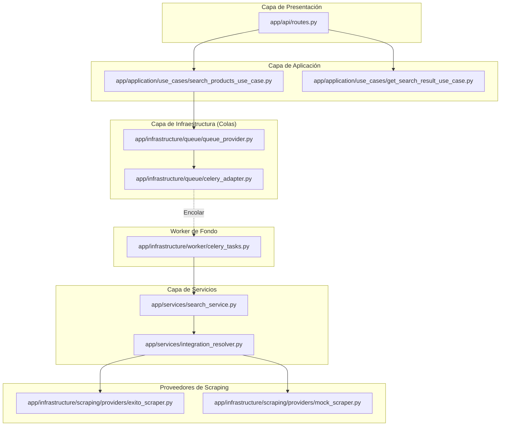

# 🕷️ Web Scraping Éxito -- Demo Backend

Backend demo en **Python** que expone una API REST para buscar productos en un e-commerce (Éxito), utilizando **Playwright** para web scraping y **Celery** para procesamiento asíncrono.

El proyecto está diseñado bajo los principios de **Arquitectura Hexagonal**, permitiendo el desacoplamiento entre la lógica de negocio y las herramientas técnicas (infraestructura).

---

## 🚀 Funcionalidad

- **Búsqueda Asíncrona**: Las peticiones de búsqueda se encolan para no bloquear la API.
- **Seguimiento de Estado**: Permite consultar el estado de una búsqueda (`pending`, `processing`, `completed`, `failed`).
- **Arquitectura de Scrapers**: Soporta múltiples proveedores (Éxito real o Mock para desarrollo).
- **Desacoplamiento de Workers**: Las tareas están desacopladas del motor de colas (Celery/RQ compatible).

---

## 🧠 Arquitectura



---

## 📁 Estructura del Proyecto

El proyecto sigue los principios de la **Arquitectura Hexagonal**, organizando el código en capas para facilitar su mantenimiento y testabilidad:

```text
app/
├── api/                       # CAPA DE PRESENTACIÓN (Interfaces de entrada)
│   ├── routes.py              # Definición de endpoints FastAPI
│   └── dependencies.py        # Inyección de dependencias para casos de uso
├── application/               # CAPA DE APLICACIÓN (Lógica de orquestación)
│   └── use_cases/             # Implementación de casos de uso específicos
├── core/                      # CAPA CORE (Configuraciones transversales)
│   ├── config.py              # Variables de entorno y ajustes globales
│   ├── celery.py              # Instancia de la aplicación Celery
│   └── logger.py              # Configuración centralizada de logs
├── infrastructure/            # CAPA DE INFRAESTRUCTURA (Detalles técnicos)
│   ├── queue/                 # Adaptadores para sistemas de colas (Celery)
│   ├── scraping/              # Implementación de scrapers con Playwright
│   └── worker/                # Wrappers para ejecución de tareas asíncronas
├── models/                    # CAPA DE DOMINIO (Entidades y tipos)
│   └── product.py             # Modelos de datos del dominio
├── services/                  # CAPA DE SERVICIOS (Lógica de negocio pura)
│   ├── search_service.py      # Orquestador de búsqueda multicanal
│   ├── integration_resolver.py # Factory para proveedores de scraping
│   └── queue_factory.py       # Factory para despacho de tareas a colas
└── main.py                    # Punto de entrada de la aplicación FastAPI
```

---

## 🏗️ Organización y Patrones

Este proyecto destaca por su desacoplamiento técnico y funcional:

- **Arquitectura Hexagonal**: La lógica de negocio (`services`) no conoce los detalles de cómo se ejecutan las tareas (`celery`) ni de qué sistema de mensajería se usa.
- **Wrapper Pattern**: Las tareas de Celery en `infrastructure/worker` son simples envoltorios que delegan al `SearchService`. Esto permite cambiar el motor de tareas (ej. a Redis Queue o subprocesos) sin tocar el código de negocio.
- **Factory Pattern**: Se utilizan factories (`QueueFactory`, `IntegrationResolver`) para inicializar proveedores de forma dinámica según la configuración del entorno.
- **Inyección de Dependencias**: Gracias a FastAPI, los casos de uso reciben sus dependencias de forma limpia, facilitando el testing con Mocks.

---

## ⚙️ Variables de Entorno

Configurables en el archivo `.env`:

- `EXITO_ENABLED`: (bool) Habilita el scraping real en Éxito. Si es `false`, usa el Mock.
- `REDIS_URL`: URL de conexión para Redis (Broker y Backend de Celery).

---

## 📦 Gestión de Dependencias

Este proyecto utiliza **[uv](https://astral.sh/uv/)** para una gestión de dependencias rápida y determinista.

---

## ▶️ Ejecución con Docker (Recomendado)

La forma más sencilla de levantar todo el stack (API, Worker, Redis):

```bash
docker compose up --build
```

- **API**: http://localhost:8000
- **Swagger Docs**: http://localhost:8000/docs
- **Health Check**: http://localhost:8000/health

---

## ▶️ Ejecución Local

1. Instalar dependencias:
   ```bash
   uv sync
   uv run playwright install --with-deps
   ```

2. Levantar servicios:
   Se requieren tres terminales o procesos:
   - **Redis**: Debe estar corriendo en el puerto 6379.
   - **API**: `uv run python -m uvicorn app.main:app --reload`
   - **Worker**: `uv run celery -A app.core.celery:celery_app worker --loglevel=info`

O utiliza el script automatizado (solo para la API):
```bash
./run.sh
```

---

## 🛠️ Endpoints Principales

1. **POST** `/api/search?product=licuadora`: Encola una búsqueda asíncrona. Retorna un `job_id`.
2. **GET** `/api/search/{job_id}`: Consulta el estado (`PENDING`, `PROCESSING`, `SUCCESS`) y el resultado final.

---

## 🛠️ Tecnologías

- **Python 3.13** (Gestión con `uv`)
- **FastAPI** (Web Framework)
- **Celery & Redis** (Fila de tareas y backend de resultados)
- **Playwright** (Navegación automatizada para scraping)
- **Selectolax** (Parsers de HTML rápidos)
- **Docker & Docker Compose** (Containerización)

---

## 👤 Autor

**José Gomez**  
*Arquitecto / Backend Developer*
